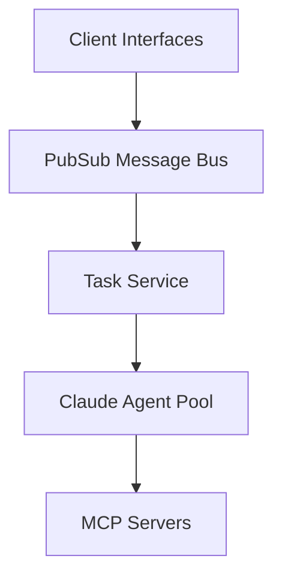
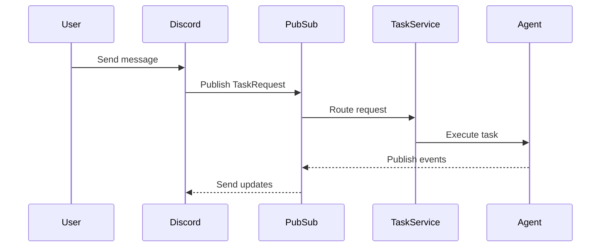

## Overview

Generates a concise architecture overview in `/home/synthia/.claude/data/synthia_architecture.md` to help engineers quickly understand Synthia's design. This is a quick-start guide for rapid comprehension - detailed information is available in the source code.

## Guiding Principles

1. **Quick Understanding** - Help engineers grasp the system in 5-10 minutes
2. **High-Level Only** - What components do, not how (source code has details)
3. **Visual First** - Mermaid diagrams for all architectures and flows
4. **Ultra-Brief** - 1-2 sentences per component, short paragraphs everywhere
5. **No Code** - Zero code snippets, type definitions, or implementation details
6. **Scannable** - Heavy use of tables, diagrams, and bullet points

## Steps

### 1. Gather Project Metrics

Collect basic quantitative data:

```bash
# Count Python files
find /home/synthia/synthia -name "*.py" | wc -l

# Count lines of code (approximate)
find /home/synthia/synthia -name "*.py" -exec cat {} \; | grep -v '^\s*#' | grep -v '^\s*$' | wc -l

# Count skills
ls /home/synthia/claude_home/.claude/skills/ | wc -l
```

### 2. Read Core Configuration

Quickly scan these files:
- `docker-compose.yml` - Main port number
- `pyproject.toml` - Key dependency categories (not individual packages)
- `synthia/main.py` - Main services initialized

Extract only essential facts (port, database type, key frameworks).

### 3. Identify Core Components

Scan the codebase structure to identify major modules:

```bash
# List main modules
ls -la /home/synthia/synthia

# List agent-related modules
ls -la /home/synthia/synthia/agents/
```

For each major component, write 1-2 sentences on what problem it solves. Skip implementation details.

### 4. Analyze Agent Architecture

Document the AI agent capabilities briefly:

**Agent Core:**
- SDK/framework in use (Claude Agent SDK)
- Key configuration aspects (1 sentence)
- Session management approach

**Tool Ecosystem:**
- List MCP servers with brief purpose (table format)

**Skills System:**
- One-line description of skills system
- List available skills in table

**Agent Event Flow:**
- Create Mermaid sequence diagram showing key events

### 5. Map System Architecture

Create a high-level architecture diagram showing:
- Client entry points (API, Discord)
- Core services and their relationships
- Data stores
- External integrations

Use Mermaid graph or flowchart diagrams - keep them conceptual, not detailed. Use clear node labels and directional arrows to show data/control flow.

### 6. Document Data Flow

Create a Mermaid sequence diagram showing the request lifecycle from client to response. Keep it simple - show main components only.

### 7. Document Extension Points

List extension mechanisms in a simple format (one sentence each):
- Adding skills
- Adding MCP servers
- Adding event handlers
- Adding API endpoints

### 8. Generate Documentation

Delete existing documentation first:
```bash
rm -f /home/synthia/.claude/data/synthia_architecture.md
mkdir -p /home/synthia/.claude/data/
```

Create documentation with these sections (keep each section concise):

1. **Overview** - One paragraph on what Synthia is, key metrics table, capabilities list
2. **System Architecture** - Mermaid diagram showing main components and relationships
3. **Component Overview** - 1-2 sentences per major component
4. **Agent Architecture**:
   - Agent core (1 paragraph)
   - Tool ecosystem (MCP servers table)
   - Skills system (1 paragraph + skills table)
   - Event flow (Mermaid diagram only, minimal text)
5. **Data Flow** - Request lifecycle Mermaid diagram
6. **Storage** - Simple table of what's persisted where
7. **Configuration** - Two tables: environment variables and dependencies
8. **Extension Points** - One sentence per extension type
9. **Synthia vs Claude Code** - Comparison table only
10. **Deployment** - Startup commands only

### 9. Document Synthia vs Claude Code

Create a comparison table showing Synthia's unique capabilities beyond vanilla Claude Code. Focus on: memory, learning, scheduling, multi-channel access, and meta-capabilities. One sentence per row.

### 10. Verify Documentation

Quick checks:
- Numbers match actual counts
- No code snippets anywhere
- Each section is brief (diagrams + tables + short paragraphs only)

## Output Format Guidelines

**DO:**
- Use Mermaid diagrams for all architecture/flow visualizations
- Use tables for lists (skills, env vars, dependencies, comparisons)
- Keep component descriptions to 1-2 sentences maximum
- Focus only on "what" each component does

**DON'T:**
- Include any code snippets (except deployment commands)
- Explain "how" things work internally
- Document implementation details
- Write long paragraphs (3-4 sentences max anywhere)
- List exhaustive details (engineers can read source code)

## Example Section Formats

### Good - Component Description:
```
### Task Service
Orchestrates requests between clients and the agent, manages session continuity, and parses responses.
```

### Bad - Too Much Detail:
```
### Task Service

The orchestration layer between API/Discord and the Claude Agent. It validates
request schemas according to Pydantic models, manages session continuity for
multi-turn conversations by caching session IDs, and can parse unstructured
agent responses into structured formats using an LLM-based parser that...
```

### Good - Skills Table:
```
| Skill | Purpose |
|-------|---------|
| `magazines` | Download and check for new magazine issues |
| `arr` | Manage arr services (Sonarr, Radarr, etc.) |
```

### Bad - Too Verbose:
```
### Skills System

Skills extend Synthia's capabilities with domain-specific knowledge and workflows.
They are markdown files that provide context, instructions, and examples for
specific tasks. The skills system discovers skills from two directories during
startup: built-in skills from the project and user-defined skills from the
user's home directory. Skills are loaded into Claude's context when invoked...
```

### Good - System Architecture Diagram:
````markdown

````

### Good - Event Flow Diagram:
````markdown

````

## Known Paths

- Main app: `/home/synthia/`
- Built-in skills: `/home/synthia/workdir/.claude/skills/`
- User-defined skills: `/home/synthia/.claude/skills/`
- Documentation output: `/home/synthia/.claude/data/synthia_architecture.md`
- Config files: `/home/synthia/pyproject.toml`, `/home/synthia/docker-compose.yml`

## Example Usage

- "Analyze Synthia's architecture"
- "Document the codebase structure"
- "Generate architecture documentation"
- "Explain Synthia's design"
- "What is Synthia's agent architecture?"

## Response to User

After completing the analysis and generating the documentation, respond to the user with exactly:

"Architecture analysis complete."

Do not include any other text, summaries, or explanations in your response.
